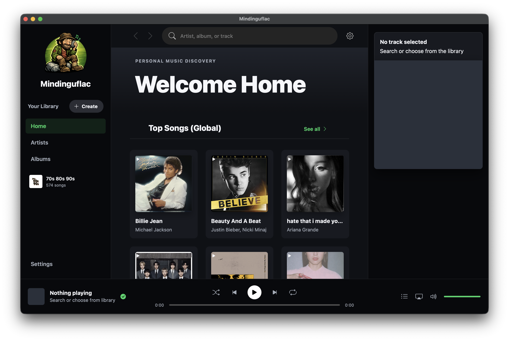
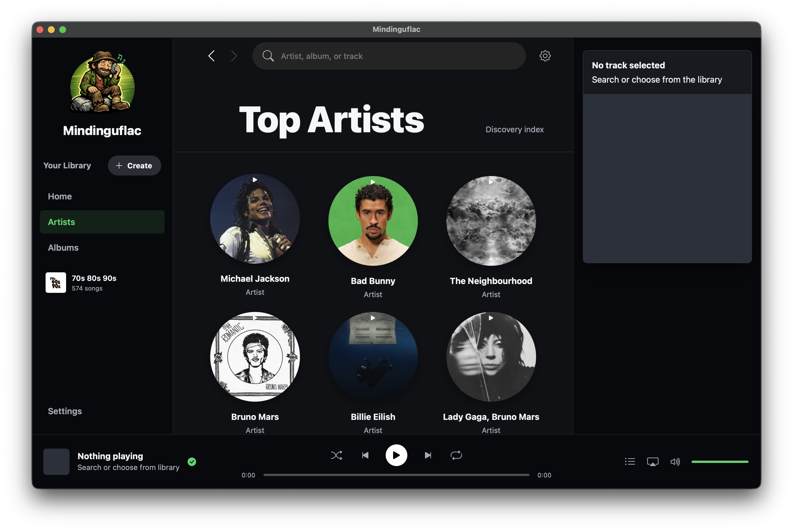
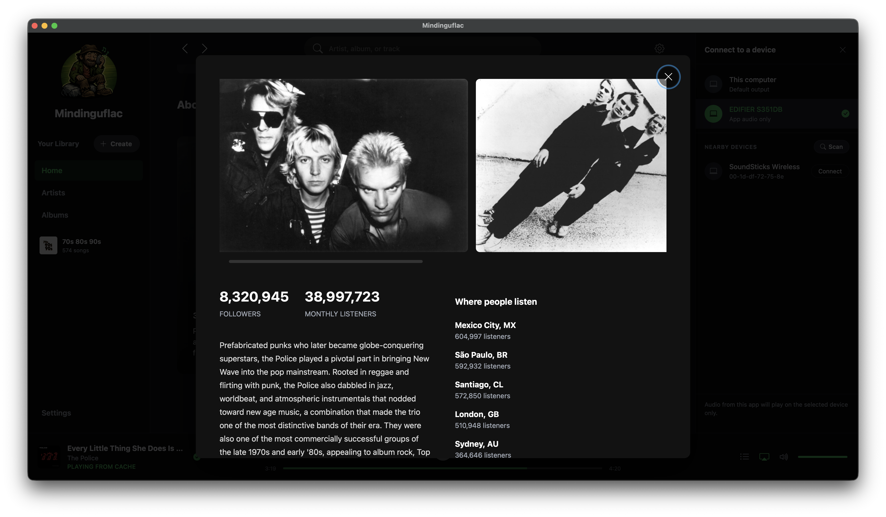
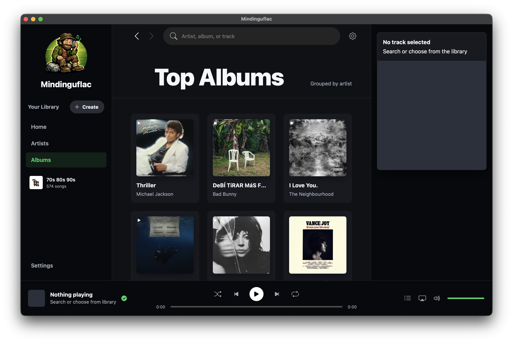
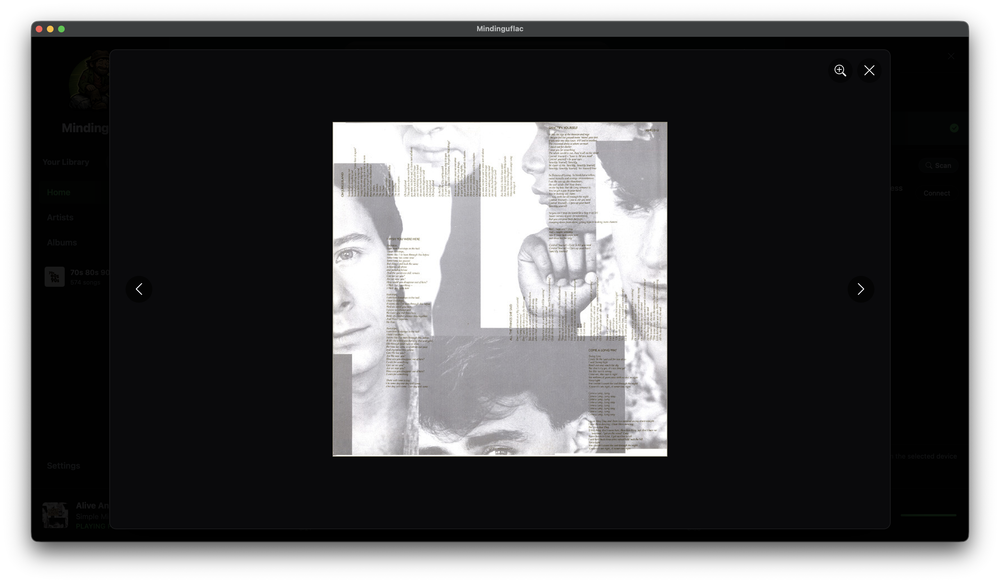
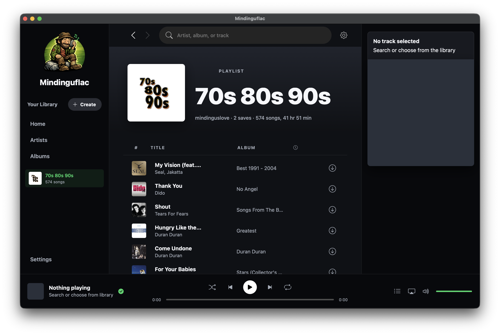
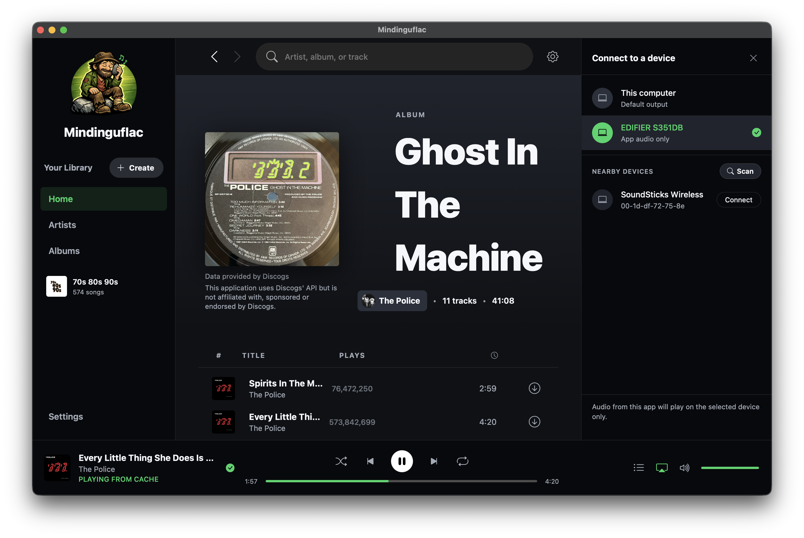

# Mindinguflac

A high-performance, private music meta-search and personal streaming platform. Mindinguflac allows users to aggregate metadata from multiple open sources, discover new artists through high-fidelity discography mapping, and manage a local media library with a modern, responsive interface.

Built with a Python backend and a Vanilla JS/CSS frontend, it functions as both a local web server and a native desktop application for macOS and Windows.

## Core Philosophy

- **Metadata Centralization**: Aggregates data from MusicBrainz, Discogs, and other open databases to provide a comprehensive view of musical history.
- **Privacy First**: Operates entirely locally. No user accounts, no tracking, and no external subscriptions required.
- **High Fidelity**: Supports FLAC and high-bitrate audio management with automatic quality-tiering.
- **Interoperability**: Seamlessly bridges web technologies with native desktop capabilities (Media Sessions, System Integrations).

## Features

- **Modern UI**: A sleek, dark-themed interface inspired by professional digital audio workstations.
- **Smart Discovery**: Dynamic multi-source search that maps artist discographies across studio albums, compilations, and live recordings.
- **Local Library Management**: Organizes your personal music collection into a structured `Artist/Album/Track` hierarchy.
- **Native Integration**:
  - **macOS**: Full "Now Playing" integration, Touch Bar support, and Media Key handling.
  - **Windows**: Native audio output device selection and silent background processing.
- **Advanced Streaming**: Intelligent buffer management allowing you to listen while your media is being indexed or moved, with stable pause/resume across active-download and cached-file handoffs.
- **Spotify Playlists**: Import any public Spotify playlist by link — Mindinguflac loads the full track list, artwork, and metadata, then lets you stream or download each track in lossless quality (see the *70s 80s 90s* playlist below).
- **Discogs Integration**: Optionally provide a Discogs personal token in Settings to fetch high-resolution vinyl sleeves, booklet images, and extended metadata for your album galleries.
- **Playlist Engine**: Create local playlists, manage queues, and import metadata from public share links.
- **High-Quality Trackers**: Integrated real-time health monitoring for public metadata swarms to ensure the most reliable connection.
- **Smart Parallel Prefetching**: Automatically downloads the next 5 tracks in your queue in parallel, ensuring instant transitions between songs.
- **Persistent SQLite Engine**: All successfully resolved Torrent magnets, YouTube URLs, and enriched metadata (Spotify IDs, ISRCs, MusicBrainz IDs) are now saved in a local SQLite database for instant offline access and to prevent redundant searches.
- **Torrent Safety Filters**: Adult/video vocabulary is stored in the local SQLite database and checked before fuzzy scoring and again after torrent metadata exposes internal file paths. Terms found in the requested track title or album are allowed only for that request; unrelated adult/video terms are still blocked.
- **Optional AI Torrent Advisor**: Clean torrent candidates can be ranked in parallel by an optional AI advisor. AI never sees candidates blocked by the local adult/video filter and cannot override metadata checks or the "first real byte progress wins" torrent race.
- **Improved YouTube Engine**: Smart quality-scoring and automatic skipping of age-restricted or blocked videos with persistent blacklisting.
- **Visual Quality Indicators**: Real-time **HI-RES** and **HQ** badges in the player sidebar indicating the actual audio fidelity being streamed.

## Screenshots

<p align="center">
  
  <br><i>Home - Discover and search your music</i>
</p>

<p align="center">
  
  <br><i>Artists - Explore your library by artist</i>
</p>

<p align="center">
  
  <br><i>Artist Detail - Rich metadata and discography browsing</i>
</p>

<p align="center">
  
  <br><i>About Artist - Extended biographies, follower counts, and global listening stats</i>
</p>

<p align="center">
  
  <br><i>Albums - High-fidelity album browsing</i>
</p>

<p align="center">
  
  <br><i>Album Booklet - View high-resolution liner notes and booklets (Discogs integration)</i>
</p>

<p align="center">
  
  <br><i>Playlists - Import and manage your Spotify collections</i>
</p>

<p align="center">
  
  <br><i>Settings - Integration with Qobuz and Discogs for enhanced metadata</i>
</p>

## Setup & Usage


### Prerequisites
- Python 3.12 (the Windows torrent build requires 3.12; `libtorrent` has no 3.13/3.14 wheels)
- FFmpeg (for audio processing)

### Virtual environments (per-OS)

This project is often developed on macOS and built for Windows from the **same
folder** (e.g. a Parallels shared drive). Because a venv contains native,
OS-specific binaries, macOS and Windows must use **separate** virtual
environments so they never overwrite each other:

| OS      | venv location                                   | Created/used by               |
|---------|-------------------------------------------------|-------------------------------|
| macOS   | `venv-macos` (in project folder)                | `run.sh`, `Mindinguflac.spec` |
| Windows | `venv-windows` (in project folder)              | `scripts/build_windows.ps1`   |

The macOS and Windows venvs are both git-ignored. Keep them separate and never
point one OS at the other's venv. Override the Windows location with the
`MINDINGUFLAC_VENV_DIR` environment variable only when needed.

### Setup (macOS)
```bash
python3.12 -m venv venv-macos
source venv-macos/bin/activate
pip install -r requirements.txt
python app.py            # or: ./run.sh (auto-creates venv-macos)
```

### Setup (Windows)
```powershell
# Build the desktop app (uses/creates .\venv-windows automatically):
powershell -ExecutionPolicy Bypass -File .\scripts\build_windows.ps1

# Or to run from source, create/use the project venv:
py -3.12 -m venv .\venv-windows
.\venv-windows\Scripts\Activate.ps1
pip install -r requirements.txt
python app.py
```

Windows desktop builds are always AMD64/x64, including on Windows-on-ARM or
Parallels. The build script rejects ARM64 Python and, when it can't find a usable
AMD64 interpreter, installs AMD64 Python 3.12 under
`%LOCALAPPDATA%\mindinguflac\python312-amd64` (falling back to the AMD64
`pythonx64` NuGet package under `%LOCALAPPDATA%\mindinguflac\python312-amd64-nuget`
if the python.org installer exits without creating the target interpreter).
Discovery is deliberately minimal: it uses `MINDINGUFLAC_PYTHON` if set, then the
hardcoded user install at
`C:\Users\<you>\AppData\Local\Programs\Python\Python312\python.exe`, then the
installer-target paths.

> **Windows-on-ARM / Parallels gotcha:** do **not** verify the architecture with
> `platform.machine()` — an AMD64 Python running under x64 emulation prints
> `ARM64` there (it reports the native host arch via `PROCESSOR_ARCHITEW6432`),
> even though the interpreter is genuinely x64. The build script ignores
> `platform.machine()` and reads the real architecture from the `python.exe`
> PE header instead. To check arch yourself, look at the installed-apps entry
> (e.g. "Python 3.12.8 (64-bit)") rather than `platform.machine()`.

The interpreter must also be a full Python install with `venv` available. A
runtime/embedded folder that only has `python.exe`, DLLs, and no standard
library can exist on disk but is not usable for the Windows build.

Open your browser to `http://127.0.0.1:8888`.

### Optional Duck.ai advisor

The torrent engine runs an AI advisor in parallel with normal torrent probing by default (powered by DuckDuckGo's free Duck.ai chat API). It is advisory only: the deterministic filters, metadata checks, and libtorrent byte-progress race still decide what downloads.

The AI receives the top 20 search results based on the local scoring algorithm. It evaluates their titles and metadata and returns a sorted list of the IDs it considers to be clean music matches. The torrent engine then attempts to download the AI's ranked candidates in the order provided (up to however many the AI selected), before falling back to the remaining unscored candidates.

> **Note on DuckDuckGo Anti-Bot:** The built-in proxy implements a reverse-engineered bypass of DuckDuckGo's `x-vqd-hash-1` and `x-fe-signals` challenges by utilizing statically spoofed, known-good headers from a real browser session. This completely removes the need for headless Chrome or frontend JavaScript evaluation. Credit to the research and implementation details found in [benoitpetit/duckduckgo-chat-cli](https://github.com/benoitpetit/duckduckgo-chat-cli/tree/master/reverse).

To disable the advisor, explicitly set `MINDINGUFLAC_AI_RERANK_PROVIDER` to `none`:

```bash
export MINDINGUFLAC_AI_RERANK_PROVIDER=none
./run.sh
```

Alternative OpenAI-compatible local/provider endpoint:

```bash
export MINDINGUFLAC_AI_RERANK_URL="http://127.0.0.1:1234/v1/chat/completions"
export MINDINGUFLAC_AI_RERANK_MODEL="your-model"
./run.sh
```

If the endpoint, network, or service limit is unavailable, the torrent job continues with the local scoring and fallback path.

## Technical Implementation

- **Backend**: Python (BaseHTTPServer/Threading) optimized for low-latency API responses.
- **Frontend**: Single Page Application (SPA) using Vanilla JavaScript and CSS variables for theme management.
- **Desktop Wrapper**: Powered by `pywebview`, providing a native app feel while maintaining web-standard flexibility.
- **Audio Engine**: Custom native audio manager for Windows and macOS, bypassing browser limitations for high-bitrate playback.
- **Native Output Handoff**: On macOS app-only output devices, active browser streaming is paused when a native device is selected and no completed cache file exists. The player remembers the current position and starts native output from that position when the cache file finishes.

---

## Roadmap / TODO

- [ ] **Queue Interface**: Dedicated UI for managing and reordering the playback queue.

---

*Disclaimer: Mindinguflac is a research-oriented meta-search tool. Users are responsible for ensuring that their use of the platform and any media they index complies with local copyright laws and the terms of service of the metadata providers.*
