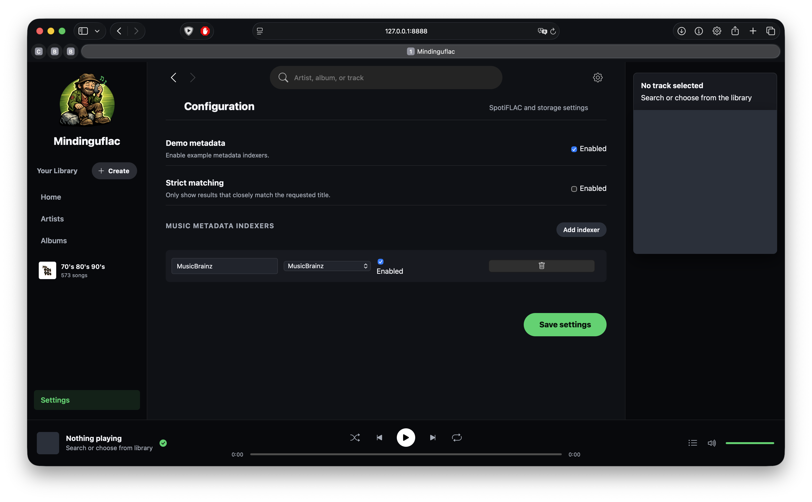

# Mindinguflac

Self-hosted music discovery, streaming, and library app with a Python backend and responsive HTML frontend. Runs as a web server you open in any browser, and also ships as a native desktop app for macOS and Windows built on pywebview.



Brand artwork lives in `static/assets`: `mindinguflac_icon.png` is the app icon, and `mindinguflac-mark.png` is the in-interface logo.

## Credits

Mindinguflac uses the [SpotiFLAC Python module](https://github.com/ShuShuzinhuu/SpotiFLAC-Module-Version) for direct service downloads. Credit for SpotiFLAC goes to its upstream authors and maintainers, including ShuKurenais and BartolomeoRusso9 as listed on the package metadata.

The app uses SpotiFLAC-backed direct service downloads for listening, caching, and copying tracks into a local music library.

## Features

- Spotify/Navidrome-style responsive web UI
- Direct service downloads through SpotiFLAC provider fallback
- Stream while a compatible partial audio file is still downloading
- Cache-to-library copying when a track is already cached
- Download-to-library mode using `Artist/Album/Track`
- Library playback wins when a track exists in the library and not in cache
- Cache/library playback source selection prefers the higher-quality local file when both exist
- Download buttons double as library toggles, including cancel while downloading and delete from library when already saved
- **Automatic Quality Upgrades**: If you download a higher quality version of a song you already have, the old version is automatically replaced and deleted from your cache/library.
- Top tracks, artists, albums, and music metadata search screen
- Music metadata search can return artist, album, and track entries
- Album metadata, artwork, and lyrics lookup support
- Quality filters: MP3 128/192/256/320 and FLAC lossless
- Stream-to-cache mode
- Album downloads also save `metadata.json`, `cover.jpg`, and lyrics text when available
- Settings screen for cache path, music library path, quality, and preferred service
- Music metadata provider layer with demo and MusicBrainz/Cover Art Archive support
- Playlist management: create playlists, add tracks via the player status icon, import from Spotify playlist URLs
- Web server mode plus pywebview desktop entry point for packaged macOS and Windows apps

## Run

```bash
python3 -m venv .venv
source .venv/bin/activate
pip install -r requirements.txt
python app.py
```

Then open:

```text
http://127.0.0.1:8888
```

## Desktop Builds

The desktop entry point is `desktop.py`. It starts the same local HTTP server on a private localhost port, then opens it in a native pywebview window.

GitHub Actions builds are defined in `.github/workflows/desktop-builds.yml`:

- macOS universal app artifact
- Windows desktop artifact

## Storage

- Cache mode stores service download payloads under `data/cache`.
- Download mode stores selected tracks under `data/music/Artist/Album/`.
- Download mode writes sidecar album files into the same album folder.
- Settings are saved in `data/config.json`.
- Desktop builds use OS-native writable defaults instead of the project `data` folder:
  - macOS cache: `~/Library/Caches/Mindinguflac/cache`
  - Windows cache: `%LOCALAPPDATA%\Mindinguflac\Cache`
  - Linux cache: `$XDG_CACHE_HOME/Mindinguflac/cache` or `~/.cache/Mindinguflac/cache`

## Implementation Notes

- Keep the web server entry point and desktop pywebview entry point separate. `app.py` should remain usable as a normal browser-served app.
- Direct download behavior lives in `service_downloader.py`; keep provider ordering tied to the selected service first, then fallback services.
- Cache/library decisions should match the clicked track identity and quality. Do not reuse a different track just because a local audio file exists.
- SpotiFLAC may expose an MP4/M4A partial before the final target file exists. Stream compatible partial files when possible, then hand off to the final local file when finished.
- Keep play/pause UI state tied to the real `<audio>` element state. After changing `audio.src`, calling `load()`, failed `play()`, `pause`, `ended`, `error`, or `emptied`, call the player button sync logic so the icon cannot get stuck.
