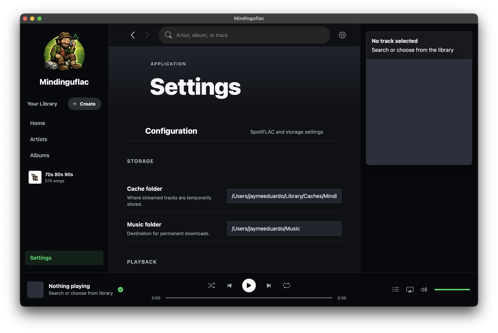

# Mindinguflac

A high-performance, private music meta-search and personal streaming platform. Mindinguflac allows users to aggregate metadata from multiple open sources, discover new artists through high-fidelity discography mapping, and manage a local media library with a modern, responsive interface.

Built with a Python backend and a Vanilla JS/CSS frontend, it functions as both a local web server and a native desktop application for macOS and Windows.

## Core Philosophy

- **Metadata Centralization**: Aggregates data from MusicBrainz, Discogs, and other open databases to provide a comprehensive view of musical history.
- **Privacy First**: Operates entirely locally. No user accounts, no tracking, and no external subscriptions required.
- **High Fidelity**: Supports FLAC and high-bitrate audio management with automatic quality-tiering.
- **Interoperability**: Seamlessly bridges web technologies with native desktop capabilities (Media Sessions, System Integrations).

## Features

- **Modern UI**: A sleek, dark-themed interface inspired by professional digital audio workstations.
- **Smart Discovery**: Dynamic multi-source search that maps artist discographies across studio albums, compilations, and live recordings.
- **Local Library Management**: Organizes your personal music collection into a structured `Artist/Album/Track` hierarchy.
- **Native Integration**:
  - **macOS**: Full "Now Playing" integration, Touch Bar support, and Media Key handling.
  - **Windows**: Native audio output device selection and silent background processing.
- **Advanced Streaming**: Intelligent buffer management allowing you to listen while your media is being indexed or moved.
- **Spotify Playlists**: Import any public Spotify playlist by link — Mindinguflac loads the full track list, artwork, and metadata, then lets you stream or download each track in lossless quality (see the *70s 80s 90s* playlist below).
- **Playlist Engine**: Create local playlists, manage queues, and import metadata from public share links.
- **High-Quality Trackers**: Integrated real-time health monitoring for public metadata swarms to ensure the most reliable connection.

## Screenshots

<p align="center">
  
  <br><i>Home - Discover and search your music</i>
</p>

<p align="center">
  
  <br><i>Artists - Explore your library by artist</i>
</p>

<p align="center">
  
  <br><i>Albums - High-fidelity album browsing</i>
</p>

<p align="center">
  
  <br><i>Playlists - Import and manage your Spotify collections</i>
</p>

<p align="center">
  
  <br><i>Settings - Configure download engines and quality</i>
</p>

## Setup & Usage


### Prerequisites
- Python 3.12 (the Windows torrent build requires 3.12; `libtorrent` has no 3.13/3.14 wheels)
- FFmpeg (for audio processing)

### Virtual environments (per-OS)

This project is often developed on macOS and built for Windows from the **same
folder** (e.g. a Parallels shared drive). Because a venv contains native,
OS-specific binaries, macOS and Windows must use **separate** virtual
environments so they never overwrite each other:

| OS      | venv location                                   | Created/used by               |
|---------|-------------------------------------------------|-------------------------------|
| macOS   | `venv-macos` (in project folder)                | `run.sh`, `Mindinguflac.spec` |
| Windows | `venv-windows` (in project folder)              | `scripts/build_windows.ps1`   |

The macOS and Windows venvs are both git-ignored. Keep them separate and never
point one OS at the other's venv. Override the Windows location with the
`MINDINGUFLAC_VENV_DIR` environment variable only when needed.

### Setup (macOS)
```bash
python3.12 -m venv venv-macos
source venv-macos/bin/activate
pip install -r requirements.txt
python app.py            # or: ./run.sh (auto-creates venv-macos)
```

### Setup (Windows)
```powershell
# Build the desktop app (uses/creates .\venv-windows automatically):
powershell -ExecutionPolicy Bypass -File .\scripts\build_windows.ps1

# Or to run from source, create/use the project venv:
py -3.12 -m venv .\venv-windows
.\venv-windows\Scripts\Activate.ps1
pip install -r requirements.txt
python app.py
```

Windows desktop builds are always AMD64/x64, including on Windows-on-ARM or
Parallels. The build script rejects ARM64 Python and, when it can't find a usable
AMD64 interpreter, installs AMD64 Python 3.12 under
`%LOCALAPPDATA%\mindinguflac\python312-amd64` (falling back to the AMD64
`pythonx64` NuGet package under `%LOCALAPPDATA%\mindinguflac\python312-amd64-nuget`
if the python.org installer exits without creating the target interpreter).
Discovery is deliberately minimal: it uses `MINDINGUFLAC_PYTHON` if set, then the
hardcoded user install at
`C:\Users\<you>\AppData\Local\Programs\Python\Python312\python.exe`, then the
installer-target paths.

> **Windows-on-ARM / Parallels gotcha:** do **not** verify the architecture with
> `platform.machine()` — an AMD64 Python running under x64 emulation prints
> `ARM64` there (it reports the native host arch via `PROCESSOR_ARCHITEW6432`),
> even though the interpreter is genuinely x64. The build script ignores
> `platform.machine()` and reads the real architecture from the `python.exe`
> PE header instead. To check arch yourself, look at the installed-apps entry
> (e.g. "Python 3.12.8 (64-bit)") rather than `platform.machine()`.

The interpreter must also be a full Python install with `venv` available. A
runtime/embedded folder that only has `python.exe`, DLLs, and no standard
library can exist on disk but is not usable for the Windows build.

Open your browser to `http://127.0.0.1:8888`.

## Technical Implementation

- **Backend**: Python (BaseHTTPServer/Threading) optimized for low-latency API responses.
- **Frontend**: Single Page Application (SPA) using Vanilla JavaScript and CSS variables for theme management.
- **Desktop Wrapper**: Powered by `pywebview`, providing a native app feel while maintaining web-standard flexibility.
- **Audio Engine**: Custom native audio manager for Windows and macOS, bypassing browser limitations for high-bitrate playback.

---

*Disclaimer: Mindinguflac is a research-oriented meta-search tool. Users are responsible for ensuring that their use of the platform and any media they index complies with local copyright laws and the terms of service of the metadata providers.*
